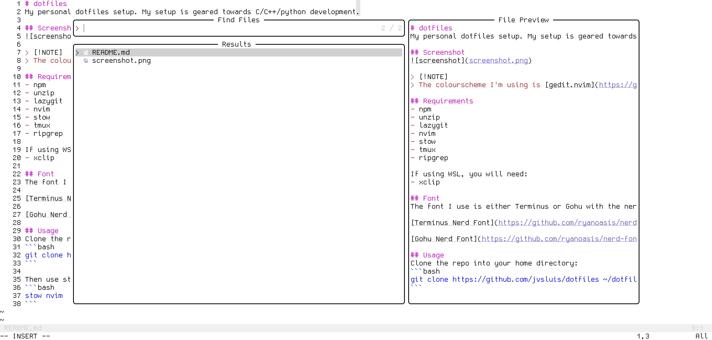
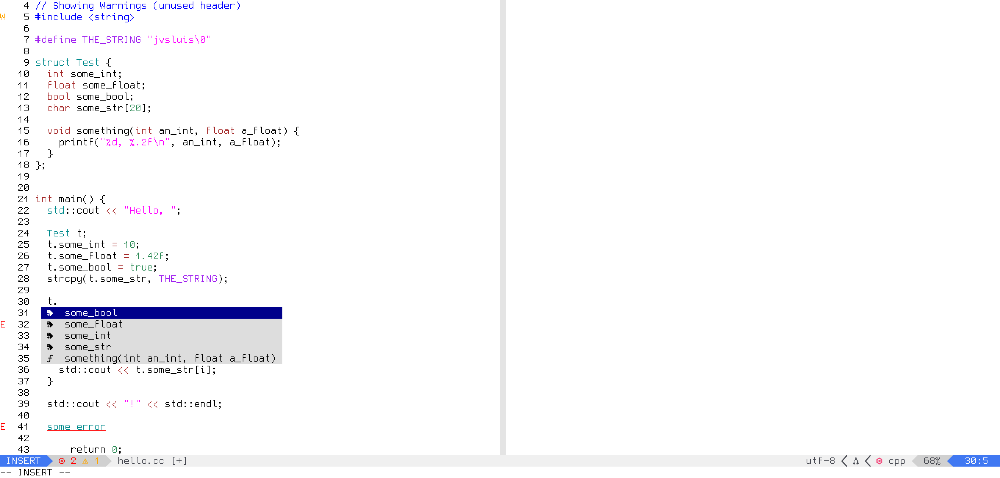

# dotfiles
My personal dotfiles setup. My setup is geared towards C/C++/python development.

## Screenshots



> [!NOTE]
> The colourscheme I'm using is [gedit.nvim](https://github.com/jvsluis/gedit.nvim)

## Requirements
- npm
- unzip
- lazygit
- nvim
- stow
- tmux
- ripgrep

If using WSL, you will need:
- xclip

## Font
The font I use is either Terminus or Gohu with the nerd font patch. You can get them here:

[Terminus Nerd Font](https://github.com/ryanoasis/nerd-fonts/releases/download/v3.1.1/Terminus.zip)

[Gohu Nerd Font](https://github.com/ryanoasis/nerd-fonts/releases/download/v3.4.0/Gohu.zip)

## Usage
Clone the repo into your home directory:
```bash
git clone https://github.com/jvsluis/dotfiles ~/dotfiles
```

Then use stow to install the desired dotfiles ie. 
```bash
stow nvim
```
