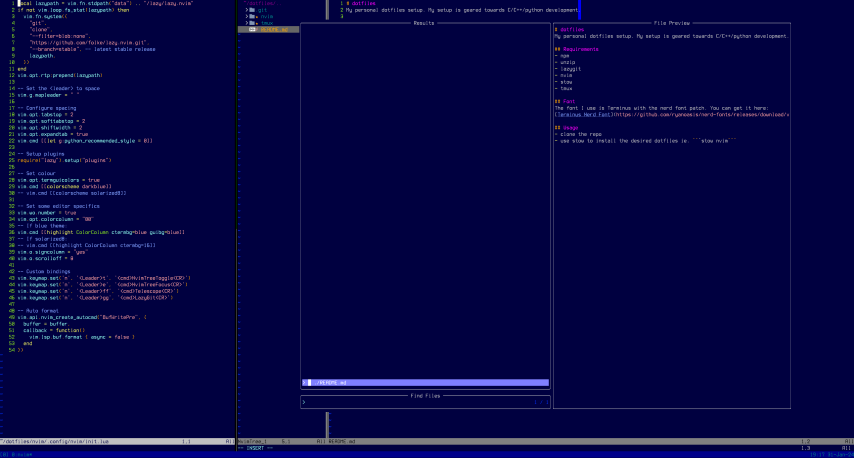

# dotfiles
My personal dotfiles setup. My setup is geared towards C/C++/python development.


## Requirements
- npm
- unzip
- lazygit
- nvim
- stow
- tmux
- ripgrep

If using WSL, you will need:
- xclip

## Font
The font I use is either Terminus or Gohu with the nerd font patch. You can get them here:
[Terminus Nerd Font](https://github.com/ryanoasis/nerd-fonts/releases/download/v3.1.1/Terminus.zip)
[Gohu Nerd Font](https://github.com/ryanoasis/nerd-fonts/releases/download/v3.4.0/Gohu.zip)

## Usage
- clone the repo
- use stow to install the desired dotfiles ie. ```stow nvim```
